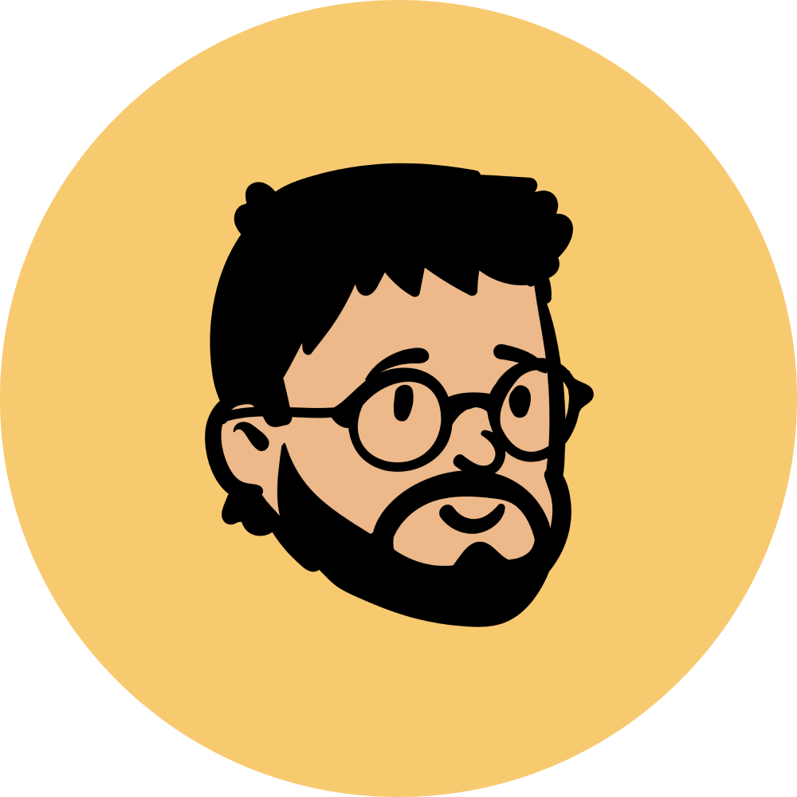

  
<h2 align="center">👋 Hi there! I'm Ali Karagoz</h3>

  <a href="https://twitter.com/alikaragoz">Twitter</a> •
  <a href="https://www.linkedin.com/in/alikaragoz">LinkedIn</a> •
  <a href="https://alikaragoz.net">Photos</a>

---
✨ I'm a Senior Software Engineer and crafter at [Mojo](https://mojo-app.com). I love creating delightful experiences through code and design.  
I previously created [SUPL](https://twitter.com/suplco) and was an early employee of a few successful startups ([GoPro Quik](https://apps.apple.com/us/app/gopro-quik-video-editor/id561350520), [Zenly](https://apps.apple.com/us/app/zenly-your-map-your-people/id838848566)).